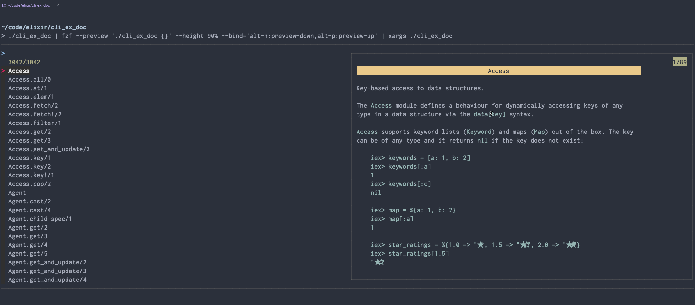

# CLI ExDoc

Elixir docs on your command line for use with `fzf`.



## Build

Build the CLI tool.
```
mix escript.build
```

If you want it in your path, you can also say this instead:

```
mix escript.install
```

## Usage

### With FZF

```
./exdoc | fzf --preview './exdoc {}' --height 90% --bind='alt-n:preview-down,alt-p:preview-up' | xargs ./exdoc
```

### Without FZF
Still useful!

List all modules & and functions
```
> ./exdoc | head -n 5
Access
Access.all/0
Access.at/1
Access.elem/1
Access.fetch/2
```

Display docs for a module
```
> ./exdoc Enum

Enum

Provides a set of algorithms to work with enumerables.

In Elixir, an enumerable is any data type that implements the Enumerable
protocol. Lists ([1, 2, 3]), Maps (%{foo: 1, bar: 2}) and Ranges (1..3) are
common data types used as enumerables:

    iex> Enum.map([1, 2, 3], fn x -> x * 2 end)
    [2, 4, 6]
# ... snip ...
```

Display docs for a specific function in a module
```
> ./exdoc Enum.filter/2

def filter(enumerable, fun)

  @spec filter(t(), (element() -> as_boolean(term()))) :: list()

Filters the enumerable, i.e. returns only those elements for which fun returns
a truthy value.

See also reject/2 which discards all elements where the function returns a
truthy value.

## Examples

    iex> Enum.filter([1, 2, 3], fn x -> rem(x, 2) == 0 end)
    [2]
```
